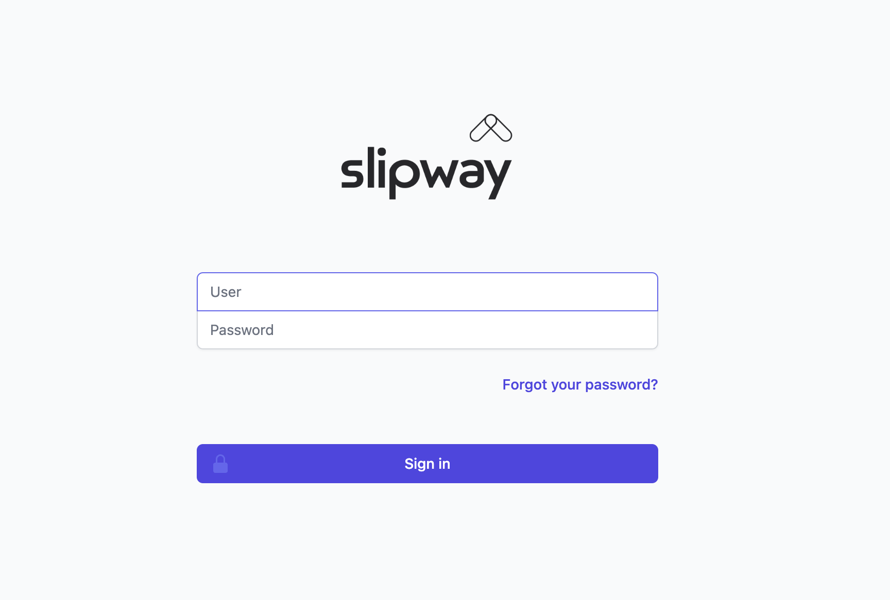
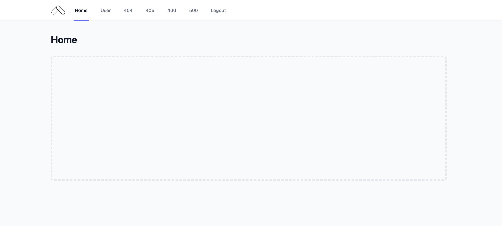

# Slipway: a Clojure companion to Jetty

[](https://github.com/operatr-io/slipway/actions/workflows/ci.yml)

### Installation

| Jetty Version | Clojars Project |
| ------------- | --------------- |
| Jetty 9 | [](https://clojars.org/io.factorhouse/slipway-jetty9) |
| Jetty 10 | [](https://clojars.org/io.factorhouse/slipway-jetty10) |
| Jetty 11 | [](https://clojars.org/io.factorhouse/slipway-jetty11) |
| Jetty 12 | Available once Jetty 12 stabilises. |

----

### Slipway by Factor House

* [Introduction](#introduction)
* [Prior Art](#prior-art)
* [Why Jetty?](#why-jetty)
* [Why Slipway?](#why-slipway)
  * [Requirements](#requirements)
  * [Primary Goals](#primary-goals)
  * [Secondary Goals](#secondary-goals)
  * [Future Goals](#future-goals)
  * [Out of Scope](#out-of-scope)
  * [Non-Goals](#non-goals)
  * [Which Version to Use?](#which-version-to-use)  
* [Using Slipway](#using-slipway)
  * [Quick Start](#quick-start)
  * [Example Servers](#example-servers)
* [Configuring Slipway](#configuring-slipway)
  * [:slipway](#slipway)
  * [:slipway.server](#slipwayserver)
  * [:slipway.handler](#slipwayhandler)
  * [:slipway.websockets](#slipwaywebsockets)
  * [All Options](#all-options)

----



# Introduction

[Eclipse Jetty](https://www.eclipse.org/jetty/) is the web server at the heart of our product, [Kpow for Apache Kafka®](https://kpow.io).

Slipway is a [Clojure](https://clojure.org/) companion to embedded Jetty with Websocket support.

Slipway holds close to Jetty idioms for configuration rather than presenting a distinct DSL.

Use the [Community Edition](https://kpow.io/community/) of Kpow with our [local-repo](https://github.com/factorhouse/kpow-local) to see Slipway in action.

## Prior Art

Slipway is based on, and in some cases includes code from the following projects:

* [sunng87/ring-jetty9-adapter](https://github.com/sunng87/ring-jetty9-adapter) by [Ning Sun](https://github.com/sunng87)
* [ring-clojure/ring](https://github.com/ring-clojure/ring/tree/master/ring-jetty-adapter) by [James Reeves](https://github.com/weavejester)

We appreciate the great open-source work of Ning Sun and James that forms the base of this project.

## Why Jetty?

Jetty is a mature, stable, commercially supported project with an [active, experienced](https://github.com/eclipse/jetty.project/graphs/contributors) team of core contributors.

Ubiquitous in the enterprise Java world, Jetty has many eyes raising issues and driving improvement.

Jetty is a great choice of web-server for a general purpose web-application.

## Why Slipway?

### Requirements

Kpow is a web-application with a SPA UI served by websockets.

We have a hard requirement to support customers on Java 8 and Java 11+.

Kpow has seemingly every possible Jetty configuration option in use by at least one end-user.

We incorporate automated NVD scanning and feedback from external security teams.

### Primary Goals

Slipway aims to provide first-class, extensible support for: 

* Core Jetty capabilities in Jetty-style
* HTTP 1.1
* HTTPS / SSL
* Synchronous handlers
* JAAS Authentication (LDAP, HashUser, etc)
* Form / basic authentication
* WebSockets
* Java 8 / 11+
* Jetty 9 / 10 / 11
* Session management
* Proxy protocol / http forwarded
* Common / sensible defaults (e.g. gzip compression)
* Configurable error handling
* Automated CVE scanning with NVD
* Comprehensive integration tests
* Ring compatibility

### Secondary Goals

* Broad support for general Jetty use-cases / configuration

### Future Goals

* Backport our SAML, OpenID and OAuth authentication implementations
* Open-source a full-stack example application using slipway in [Shortcut](https://github.com/factorhouse/shortcut).

### Out of Scope

* Http2/3
* Asynchronous Handlers
* Ajax (including auto-fallback)

### Non-Goals

* A simplified DSL for Jetty

### Which Version to Use?

* Jetty 9: If you require running with Java 8
* Jetty 10: Recommended for general use, requires Java 11+
* Jetty 11: If you want to run with Jakarta rather than Javax, requires Java 11+

## Using Slipway

### Quick Start

Choose a project by Jetty version, then open a REPL.

Start slipway with a ring-handler and a map of configuration options:

```clojure 
(require '[slipway :as slipway])
(require '[slipway.server :as server])
(require '[slipway.connector.http :as http])

(defn handler [_] {:status 200 :body "Hello world"})

(def http-connector #::http{:port 3000})

(slipway/start handler #::server{:connectors [http-connector]})
```

Your hello world application is now running on [http://localhost:3000](http://localhost:3000).

### Example Servers

Various configuration of Slipway can be found in the [example.clj](common/test/slipway/example.clj) namespace.

The stateful start!/stop! functions within that namespace are not considered canonical for Slipway, they are a convenience for our integration tests. 

```clojure
(require '[slipway.example :as example])

(example/start! [:http :hash-auth])
```

Your sample application with [property file based authz](https://docs.kpow.io/authentication/file/) is now available on [http://localhost:3000](http://localhost:3000).

Login with jetty/jetty, admin/admin, plain/plain, other/other, or user/password as defined in [hash-realm.properties](common/dev-resources/jaas/hash-realm.properties).

After login the default home-page presents some useful links for user info and error pages.

-----



## Configuring Slipway

Jetty is sophisticated as it addresses a complex domain with flexibility and configurability.

Slipway holds close to Jetty idioms for configuration rather than presenting a simplified DSL.

Our goal is to support Jetty configuration in the style that Jetty intends, providing the means to leverage all of Jetty's capabilities if you require, while providing sensible defaults for basic behaviour.

Slipway takes a map of namespaced configuration.

### :slipway

The top-level namespace provides configuration to determine if slipway joins the Jetty threadpool.

```clojure
#:slipway{:join? "join the Jetty threadpool, blocks the calling thread until jetty exits, default false"}
```

### :slipway.server

Configuration of core server options.

```clojure
#:slipway.server{:handler       "the base Jetty handler implementation (:default defmethod impl found in slipway.handler)"
                 :connectors    "the connectors supported by this server"
                 :thread-pool   "the thread-pool used by this server (leave null for reasonable defaults)"
                 :error-handler "the error-handler used by this server for Jetty level errors"}
```

#### :slipway.server/handler

Slipway provides the following default server-handler implementations:

1. [slipway-jetty9/src/slipway/handler.clj](slipway-jetty9/src/slipway/handler.clj#L61): for Jetty 9 
2. [common-jetty1x/src/slipway/handler.clj](common-jetty1x/src/slipway/handler.clj#L45): for Jetty 10/11

Use a custom server-handler by implementing a new server/handler defmethod and configuring the dispatch key.

#### :slipway.server/connectors

Slipway accepts a list of server-connectors, allowing you to run multi-connector setups, e.g.

```clojure
(ns slipway.example
  (:require [slipway.connector.http :as http]
            [slipway.connector.https :as https]
            [slipway.server :as server]))

(def http-connector #::http{:port 3000})

(def https-connector #::https{:port                3443
                              :keystore            "dev-resources/my-keystore.jks"
                              :keystore-type       "PKCS12"
                              :keystore-password   "password"
                              :truststore          "dev-resources/my-truststore.jks"
                              :truststore-password "password"
                              :truststore-type     "PKCS12"})

(def server #::server{:connectors [http-connector https-connector]})
```

#### :slipway.server/thread-pool

Leave nil for the sensible default threadpool or provide a concrete `org.eclipse.jetty.util.thread.ThreadPool`.

#### :slipway.server/error-handler

Provide a concrete `org.eclipse.jetty.server.handler.ErrorHandler` to manage Jetty-level errors (not to be confused with ring / application level errors which will be handled separately within your application.

Slipway provides a utility namespace for general-purpose ErrorHandler creation and error logging:

1. [common-javax/src/slipway/error.clj](common-javax/src/slipway/error.clj#L14): Jetty 9 and 10.
2. [common-jakarta/src/slipway/error.clj](common-jakarta/src/slipway/error.clj#L14): Jetty 11.

### :slipway.handler

Configuration of the default server-handler (same for all versions of Jetty).

```clojure
#:slipway.handler{:context-path    "the root context path, default '/'"
                  :ws-path         "the path serving the websocket upgrade handler, default '/chsk'"
                  :null-path-info? "true if /path is not redirected to /path/, default true"}
```

### :slipway-websockets

Configuration of websockets options.

Jetty 10/11 provides more configurability of websockets, as you can see in the different options below:

```clojure
;; Jetty 10 / Jetty 11 Websockets
#:slipway.websockets{:idle-timeout            "max websocket idle time (in ms), default 500000"
                     :input-buffer-size       "max websocket input buffer size (in bytes)"
                     :output-buffer-size      "max websocket output buffer size (in bytes)"
                     :max-text-message-size   "max websocket text message size (in bytes, default 65536)"
                     :max-binary-message-size "max websocket binary message size (in bytes)"
                     :max-frame-size          "max websocket frame size (in bytes)"
                     :auto-fragment           "websocket auto fragment (boolean)"}

;; Jetty 9 Websockets
#:slipway.websockets{:idle-timeout            "max websocket idle time (in ms), default 500000"
                     :input-buffer-size       "max websocket input buffer size"
                     :max-text-message-size   "max websocket text message size"
                     :max-binary-message-size "max websocket binary message size"}
```

The defaults should be reasonable for general use. See Jetty docs to understand how to tune websockets for your own purposes.

----

### All Options

```clojure
  #:slipway.handler.gzip{:enabled?            "is gzip enabled? default true"
                         :included-mime-types "mime types to include (without charset or other parameters), leave nil for default types"
                         :excluded-mime-types "mime types to exclude (replacing any previous exclusion set)"
                         :min-gzip-size       "min response size to trigger dynamic compression (in bytes, default 1024)"}

  #:slipway.connector.https{:host                       "the network interface this connector binds to as an IP address or a hostname.  If null or 0.0.0.0, then bind to all interfaces. Default null/all interfaces"
                            :port                       "port this connector listens on. If set to 0 a random port is assigned which may be obtained with getLocalPort(), default 443"
                            :idle-timeout               "max idle time for a connection, roughly translates to the Socket.setSoTimeout. Default 200000 ms"
                            :http-forwarded?            "if true, add the ForwardRequestCustomizer. See Jetty Forward HTTP docs"
                            :proxy-protocol?            "if true, add the ProxyConnectionFactor. See Jetty Proxy Protocol docs"
                            :http-config                "a concrete HttpConfiguration object to replace the default config entirely"
                            :configurator               "a fn taking the final connector as argument, allowing further configuration"
                            :keystore                   "keystore to use, either path (String) or concrete KeyStore"
                            :keystore-type              "type of keystore, e.g. JKS"
                            :keystore-password          "password of the keystore"
                            :key-manager-password       "password for the specific key within the keystore"
                            :truststore                 "truststore to use, either path (String) or concrete KeyStore"
                            :truststore-password        "password of the truststore"
                            :truststore-type            "type of the truststore, eg. JKS"
                            :include-protocols          "a list of protocol name patterns to include in SSLEngine"
                            :exclude-protocols          "a list of protocol name patterns to exclude from SSLEngine"
                            :replace-exclude-protocols? "if true will replace existing exclude-protocols, otherwise will add them"
                            :exclude-ciphers            "a list of cipher suite names to exclude from SSLEngine"
                            :replace-exclude-ciphers?   "if true will replace existing exclude-ciphers, otherwise will add them"
                            :security-provider          "the security provider name"
                            :client-auth                "either :need or :want to set the corresponding need/wantClientAuth field"
                            :ssl-context                "a concrete pre-configured SslContext"
                            :sni-required?              "true if a SNI certificate is required, default false"
                            :sni-host-check?            "true if the SNI Host name must match, default false"}

  #:slipway.connector.http{:host            "the network interface this connector binds to as an IP address or a hostname.  If null or 0.0.0.0, then bind to all interfaces. Default null/all interfaces."
                           :port            "port this connector listens on. If set to 0 a random port is assigned which may be obtained with getLocalPort(), default 80"
                           :idle-timeout    "max idle time for a connection, roughly translates to the Socket.setSoTimeout. Default 200000 ms"
                           :http-forwarded? "if true, add the ForwardRequestCustomizer. See Jetty Forward HTTP docs"
                           :proxy-protocol? "if true, add the ProxyConnectionFactory. See Jetty Proxy Protocol docs"
                           :http-config     "a concrete HttpConfiguration object to replace the default config entirely"
                           :configurator    "a fn taking the final connector as argument, allowing further configuration"}

  #:slipway.security{:realm               "the Jetty authentication realm"
                     :hash-user-file      "the path to a Jetty Hash User File"
                     :login-service       "a Jetty LoginService identifier, 'jaas' and 'hash' supported by default"
                     :identity-service    "a concrete Jetty IdentityService"
                     :authenticator       "a concrete Jetty Authenticator (e.g. FormAuthenticator or BasicAuthenticator)"
                     :constraint-mappings "a list of concrete Jetty ConstraintMapping"}
                     
  #:slipway.session{:secure-request-only?  "set the secure flag on session cookies (default true)"
                    :http-only?            "set the http-only flag on session cookies (default true)"
                    :same-site             "set session cookie same-site policy to :none, :lax, or :strict (default :strict)"
                    :max-inactive-interval "max session idle time (in s, default -1)"
                    :tracking-modes        "a set (colloection) of #{:cookie, :ssl, or :url}"
                    :cookie-name           "the name of the session cookie"
                    :session-id-manager    "the meta manager used for cross context session management"
                    :refresh-cookie-age    "max time before a session cookie is re-set (in s)"
                    :path-parameter-name   "name of path parameter used for URL session tracking"}

  ;; Jetty 10 / Jetty 11 Websockets
  #:slipway.websockets{:idle-timeout            "max websocket idle time (in ms), default 500000"
                       :input-buffer-size       "max websocket input buffer size (in bytes)"
                       :output-buffer-size      "max websocket output buffer size (in bytes)"
                       :max-text-message-size   "max websocket text message size (in bytes, default 65536)"
                       :max-binary-message-size "max websocket binary message size (in bytes)"
                       :max-frame-size          "max websocket frame size (in bytes)"
                       :auto-fragment           "websocket auto fragment (boolean)"}

  ;; Jetty 9 Websockets
  #:slipway.websockets{:idle-timeout            "max websocket idle time (in ms), default 500000"
                       :input-buffer-size       "max websocket input buffer size"
                       :max-text-message-size   "max websocket text message size"
                       :max-binary-message-size "max websocket binary message size"}

  #:slipway.handler{:context-path    "the root context path, default '/'"
                    :ws-path         "the path serving the websocket upgrade handler, default '/chsk'"
                    :null-path-info? "true if /path is not redirected to /path/, default true"}

  #:slipway.server{:handler       "the base Jetty handler implementation (:default defmethod impl found in slipway.handler)"
                   :connectors    "the connectors supported by this server"
                   :thread-pool   "the thread-pool used by this server (leave null for reasonable defaults)"
                   :error-handler "the error-handler used by this server for Jetty level errors"}

  #:slipway{:join? "join the Jetty threadpool, blocks the calling thread until jetty exits, default false"}
```

### TBD Below this line is out of date, will be updated shortly.
----

### WebSockets

Slipway provides the same API as the [ring-jetty9-adapter](https://github.com/sunng87/ring-jetty9-adapter) for upgrading HTTP requests to WebSockets. 

```clojure 
(require '[slipway.websockets :as ws])
(require '[slipway.server :as slipway])

(def ws-handler {:on-connect (fn [ws] (ws/send! ws "Hello world"))
                 :on-error (fn [ws e])
                 :on-close (fn [ws status-code reason])
                 :on-text (fn [ws text-message])
                 :on-bytes (fn [ws bytes offset len])
                 :on-ping (fn [ws bytebuffer])
                 :on-pong (fn [ws bytebuffer])})

(defn handler [req]
  (if (ws/upgrade-request? req)
    (ws/upgrade-response ws-handler)
    {:status 406}))
    
(slipway/run-jetty handler {:port 3000 :join? false})
```

The `ws` object passed to each handler function implements the `slipway.websockets.WebSockets` protocol:

```clojure 
(defprotocol WebSockets
  (send! [this msg] [this msg callback])
  (ping! [this] [this msg])
  (close! [this] [this status-code reason])
  (remote-addr [this])
  (idle-timeout! [this ms])
  (connected? [this])
  (req-of [this]))
```

#### Sente Integration

Slipway supports [Sente](https://github.com/ptaoussanis/sente) out-of-the box. 

Include Sente in your project's dependencies and follow Sente's [getting started guide](https://github.com/ptaoussanis/sente#getting-started), and use the slipway web-server adapter:

```clojure 
(require '[slipway.sente :refer [get-sch-adapter]])
```

### JAAS integration

JAAS implements a Java version of the standard Pluggable Authentication Module (PAM) framework.

JAAS can be used for two purposes:

* for authentication of users, to reliably and securely determine who is currently executing Java code
* for authorization of users to ensure they have the access control rights (permissions) required to do the actions performed.

For more information visit the [Jetty documentation](https://www.eclipse.org/jetty/documentation/jetty-10/operations-guide/index.html#og-jaas).

#### Usage

TODO

#### jaas.config

Start your application (JAR or REPL session) with the additional JVM opt `-Djava.security.auth.login.config=/some/path/to/jaas.config`

For example configurations refer to [this tutorial](https://wiki.eclipse.org/Jetty/Tutorial/JAAS#Configuring_a_JAASLoginService)

#### Hash realm authentication

The simplest JAAS authentication module. A static list of hashed users in a file. 

Example `jaas.config`: ('my-app' must be the same as the configured :realm)

``` 
my-app {
           org.eclipse.jetty.jaas.spi.PropertyFileLoginModule required
           debug="true"
           file="dev-resources/jaas/hash-realm.properties";
       };
```

Example `hash-realm.properties`:

```
# This file defines users passwords and roles for a HashUserRealm
#
# The format is
#  <username>: <password>[,<rolename> ...]
#
# Passwords may be clear text, obfuscated or checksummed.  The class
# org.eclipse.jetty.util.security.Password should be used to generate obfuscated
# passwords or password checksums
#
# If DIGEST Authentication is used, the password must be in a recoverable
# format, either plain text or OBF:.
#
jetty: MD5:164c88b302622e17050af52c89945d44,kafka-users,content-administrators
admin: CRYPT:adpexzg3FUZAk,server-administrators,content-administrators,kafka-admins
other: OBF:1xmk1w261u9r1w1c1xmq,kafka-admins,kafka-users
plain: plain,content-administrators
user: password,kafka-users
# This entry is for digest auth.  The credential is a MD5 hash of username:realmname:password
digest: MD5:6e120743ad67abfbc385bc2bb754e297,kafka-users
```

#### LDAP authentication

Example `jaas.config`:

``` 
ldaploginmodule {
   org.eclipse.jetty.plus.jaas.spi.LdapLoginModule required
   debug="true"
   contextFactory="com.sun.jndi.ldap.LdapCtxFactory"
   hostname="ldap.example.com"
   port="389"
   bindDn="cn=Directory Manager"
   bindPassword="directory"
   authenticationMethod="simple"
   forceBindingLogin="false"
   userBaseDn="ou=people,dc=alcatel"
   userRdnAttribute="uid"
   userIdAttribute="uid"
   userPasswordAttribute="userPassword"
   userObjectClass="inetOrgPerson"
   roleBaseDn="ou=groups,dc=example,dc=com"
   roleNameAttribute="cn"
   roleMemberAttribute="uniqueMember"
   roleObjectClass="groupOfUniqueNames";
   };
```

## Examples

Check back soon! 

## License

Distributed under the MIT License.

Copyright (c) 2022 Factor House
