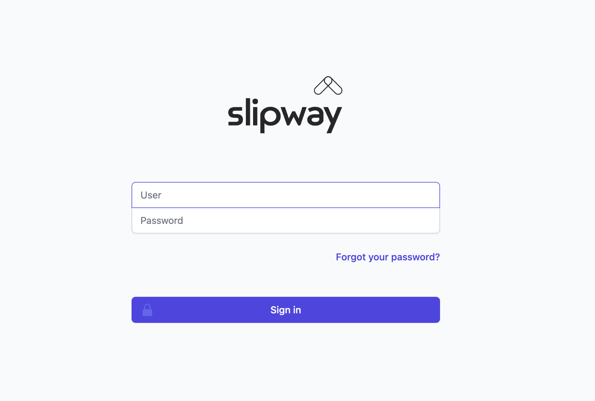
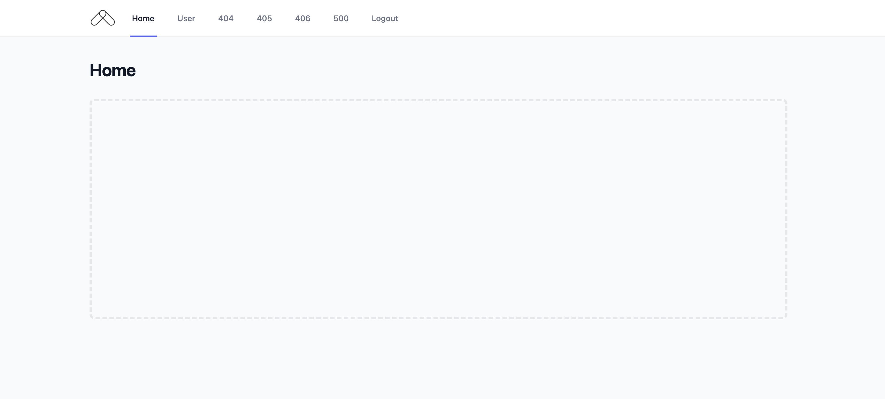

# Slipway: a Clojure Companion to Jetty 12.1

[](https://github.com/factorhouse/slipway/actions/workflows/ci.yml)
[](https://clojars.org/io.factorhouse/slipway-jetty12)

----

## Slipway by [Factor House](https://factorhouse.io)

* [Introduction](#introduction)
* [Why Jetty?](#why-jetty)
* [Why Slipway?](#why-slipway)
  * [Requirements](#requirements)
  * [Primary Goals](#primary-goals)
  * [Secondary Goals](#secondary-goals)
  * [Out of Scope](#out-of-scope)
  * [Non-Goals](#non-goals)
* [Using Slipway](#using-slipway)
  * [Quick Start](#quick-start)
  * [Example Servers](#example-servers)
* [Configuring Slipway](#configuring-slipway)
  * [:slipway](#slipway)
  * [:slipway.server](#slipwayserver)
  * [:slipway.handler](#slipwayhandler)
  * [:slipway.websockets](#slipwaywebsockets)
  * [:slipway.session](#slipwaysession)
  * [:slipway.security](#slipwaysecurity)
  * [:slipway.connector.http](#slipwayconnectorhttp)
  * [:slipway.connector.https](#slipwayconnectorhttps)
  * [:slipway.handler.compression](#slipwayhandlercompression)
* [Sente Websockets](#sente-websockets)
* [JAAS Authentication](#jaas-authentication)
  * [-Djava.security.auth.login.config](#-djavasecurityauthloginconfig)
  * [Hash Authentication](#hash-authentication)
  * [LDAP Authentication](#ldap-authentication)
* [License](#license)
* [Contributing](#contributing)

----



# Introduction

[Eclipse Jetty](https://www.eclipse.org/jetty/) is the web server at the heart of our product, [Kpow for Apache Kafka®](https://factorhouse.io/kpow).

Slipway is a [Clojure](https://clojure.org/) companion to embedded Jetty 12.1 with WebSocket support.

Slipway configuration models Jetty instead of exposing a simplified DSL. This approach allows leverage of all Jetty capabilities while providing sensible defaults for basic behaviour. If in doubt, read the [Jetty docs](https://jetty.org/docs/).

Use the [Community Edition](https://kpow.io/get-started/) of Kpow with our [local-repo](https://github.com/factorhouse/kpow-local) to see Slipway in action.

> **Archived versions**: Previous support for Jetty 9, 10, and 11 is preserved in the [`archive/`](archive/) directory but is no longer maintained. Slipway 2.x targets Jetty 12.1 exclusively.

## Why Jetty?

Jetty is a mature, stable, commercially supported project with an [active, experienced](https://github.com/eclipse/jetty.project/graphs/contributors) team of core contributors.

Ubiquitous in the enterprise Java world, Jetty has many eyes raising issues and driving improvement.

Jetty is a great choice of web server for a general purpose web application.

## Why Slipway?

### Requirements

Kpow is a web application with a SPA UI served by WebSockets.

Kpow has seemingly every possible Jetty configuration option in use by at least one end-user.

We incorporate automated NVD scanning and feedback from external security teams.

### Primary Goals

Slipway provides first-class, extensible support for:

* Core Jetty capabilities in Jetty-style
* HTTP 1.1
* HTTPS / SSL
* Synchronous handlers
* JAAS Authentication (LDAP, HashUser, etc)
* Form / basic authentication
* WebSockets
* Java 17+
* Jetty 12.1
* Session management
* Proxy protocol / HTTP forwarded
* HTTP compliance modes (RFC9110, RFC2616, RFC7230, etc)
* Compression (Gzip and extensible)
* Configurable error handling
* Automated CVE scanning with NVD
* Comprehensive integration tests

### Secondary Goals

* Broad support for general Jetty use-cases / configuration

### Out of Scope

* HTTP/2 and HTTP/3
* Asynchronous handlers
* Ajax (including auto-fallback)

### Non-Goals

* A simplified DSL for Jetty

## Using Slipway

Add `io.factorhouse/slipway-jetty12` to your project dependencies:

```clojure
;; deps.edn
{io.factorhouse/slipway-jetty12 {:mvn/version "2.0.6"}}

;; project.clj
[io.factorhouse/slipway-jetty12 "2.0.6"]
```

Requires Java 17+.

### Quick Start

Open a REPL and start Slipway with a ring handler and a map of configuration options:

```clojure
(require '[slipway :as slipway])
(require '[slipway.server :as server])
(require '[slipway.connector.http :as http])

(defn handler [_] {:status 200 :body "Hello world"})

(def http-connector #::http{:port 3000})

(slipway/start handler #::server{:connectors [http-connector]})
```

Your hello world application is now running on [http://localhost:3000](http://localhost:3000).

To stop the server:

```clojure
(slipway/stop server)
```

### Example Servers

The [`test/slipway/test_server.clj`](test/slipway/test_server.clj) namespace contains a range of example server configurations for use in development and testing.

The stateful `start!`/`stop!` functions are a convenience for integration tests and local development, not canonical Slipway usage.

```clojure
(require '[slipway.test-server :as test-server])

;; Start a plain HTTP server
(test-server/start! [:http])

;; Start with hash-based form authentication
(test-server/start! [:http] :hash-form)

;; Start with basic authentication
(test-server/start! [:http] :basic-auth)

;; Start with HTTP + HTTPS
(test-server/start! [:http+https])
```

Your sample application is available on [http://localhost:3000](http://localhost:3000).

For hash auth, login with `jetty/jetty`, `admin/admin`, `plain/plain`, `other/other`, or `user/password` as defined in [hash-realm.properties](dev-resources/jaas/hash-realm.properties).

After login, the default home page presents useful links for user info and error pages.

-----



## Configuring Slipway

Jetty is sophisticated as it addresses a complex domain with flexibility and configurability.

Slipway holds close to Jetty idioms for configuration rather than presenting a simplified DSL.

Slipway takes a single map of namespaced configuration. Namespaces correspond to Jetty domain models and can be considered as separate maps then merged.

### :slipway

The top-level namespace determines whether Slipway joins the Jetty thread pool.

```clojure
#:slipway{:join? "join the Jetty threadpool, blocks the calling thread until Jetty exits, default false"}
```

### :slipway.server

Configuration of core server options.

```clojure
#:slipway.server{:handler       "the base Jetty handler implementation (:default defmethod impl found in slipway.handler)"
                 :connectors    "the connectors supported by this server"
                 :thread-pool   "the thread-pool used by this server (nil for default behaviour)"
                 :scheduler     "the scheduler used by this server (nil for default behaviour)"
                 :buffer-pool   "the buffer-pool used by this server (nil for default behaviour)"
                 :error-handler "the error-handler used by this server for Jetty-level errors"}
```

#### :slipway.server/handler

Slipway provides a default server-handler implementation via a `defmethod` dispatch in [`src/slipway/handler.clj`](src/slipway/handler.clj).

Use a custom server-handler by implementing a new `server/handler` defmethod and providing its dispatch key as `::server/handler`.

#### :slipway.server/connectors

Slipway accepts a list of server connectors, allowing multi-connector setups, e.g.:

```clojure
(ns slipway.example
  (:require [slipway.connector.http :as http]
            [slipway.connector.https :as https]
            [slipway.server :as server]))

(def http-connector #::http{:port 3000})

(def https-connector #::https{:port                3443
                              :keystore            "dev-resources/my-keystore.jks"
                              :keystore-type       "PKCS12"
                              :keystore-password   "password"
                              :truststore          "dev-resources/my-truststore.jks"
                              :truststore-password "password"
                              :truststore-type     "PKCS12"})

(def server #::server{:connectors [http-connector https-connector]})
```

#### :slipway.server/error-handler

Provide a concrete `org.eclipse.jetty.server.handler.ErrorHandler` to manage Jetty-level errors (not to be confused with ring/application-level errors handled within your application).

Slipway provides a utility for creating custom error handlers in [`src/slipway/error.clj`](src/slipway/error.clj):

```clojure
(require '[slipway.error :as error])

(defn body-fn
  [_request _charset code _uri message _cause]
  (str "<html><body><h1>" code " " message "</h1></body></html>"))

(def my-error-handler (error/handler body-fn))
```

### :slipway.handler

Configuration of the default server handler.

```clojure
#:slipway.handler{:context-path    "the root context path, default '/'"
                  :null-path-info? "true if /path is not redirected to /path/, default true"}
```

### :slipway.websockets

Configuration of WebSocket options.

```clojure
#:slipway.websockets{:enabled?                 "are websockets enabled? default true"
                     :path-spec                "the websocket path-spec, default '/chsk'"
                     :idle-timeout-ms          "max websocket idle time in ms, default 300000"
                     :input-buffer-bytes       "max websocket input buffer size in bytes"
                     :output-buffer-bytes      "max websocket output buffer size in bytes"
                     :max-text-message-bytes   "max websocket text message size that can be received in bytes"
                     :max-binary-message-bytes "max websocket binary message size that can be received in bytes"
                     :max-frame-bytes          "max websocket frame size in bytes"
                     :max-outgoing-frames      "max websocket frames waiting to be sent per session, default -1"
                     :auto-fragment            "websocket auto fragment (boolean), default true"}
```

See the Jetty docs to understand how to tune WebSockets for your own purposes.

### :slipway.session

Configuration of HTTP session options.

```clojure
#:slipway.session{:secure-request-only?    "set the secure flag on session cookies (default true)"
                  :http-only?              "set the http-only flag on session cookies (default true)"
                  :same-site               "set session cookie same-site policy to :none, :lax, or :strict (default :strict)"
                  :max-inactive-interval-s "max session idle time in seconds (default -1, no expiry)"
                  :cookie-name             "the name of the session cookie (default 'JSESSIONID')"
                  :session-id-manager      "the meta manager used for cross-context session management"
                  :refresh-cookie-age-s    "max time before a session cookie is re-set in seconds"
                  :using-cookies           "true if cookies are used to track sessions (default true)"
                  :using-uri-parameters    "true if URI parameters are used to track sessions (default false)"
                  :path-parameter-name     "name of path parameter used for URL session tracking"}
```

### :slipway.security

Configuration of Jetty auth options. See [JAAS Authentication](#jaas-authentication) below for configuration guides.

```clojure
#:slipway.security{:handler "identifies a SecurityHandler impl, 'jaas', 'hash', and 'openid' supported by default"}
```

Three auth implementations are provided by default.

#### :slipway.security.hash

Configure simple authentication with Jetty's built in HashLoginService

```clojure
#:slipway.security.hash{:realm               "optional Jetty authentication realm"
                        :user-file           "the path to a Jetty hash-user file"
                        :users               "a sequence of [^String user-name, ^String credential, ^String[] [roles]]"
                        :authenticator       "a concrete Jetty Authenticator (e.g. FormAuthenticator or BasicAuthenticator)"
                        :constraint-mappings "a vector of [^String pathSpec, org.eclipse.jetty.security.Constraint]"
                        :identity-service    "a concrete Jetty IdentityService"}
```

#### :slipway.security.jaas

Configure JAAS authentication with Jetty's built in [JAAS compatible login-modules](https://jetty.org/docs/jetty/12.1/operations-guide/security/jaas-support.html)

```clojure
#:slipway.security.jaas{:realm               "the Jetty authentication realm"
                        :authenticator       "a concrete Jetty Authenticator (e.g. FormAuthenticator or BasicAuthenticator)"
                        :constraint-mappings "a vector of [^String pathSpec, org.eclipse.jetty.security.Constraint]"
                        :identity-service    "an (optional) concrete Jetty IdentityService"}
```

Example constraint mapping:

```clojure
(import '[org.eclipse.jetty.security Constraint])

(def constraints
  [["/up"    Constraint/ALLOWED]
   ["/css/*" Constraint/ALLOWED]
   ["/img/*" Constraint/ALLOWED]
   ["/*"     Constraint/ANY_USER]])
```

### :slipway.connector.http

Configuration of an HTTP server connector.

```clojure
#:slipway.connector.http{:name                       "the name of this connector (useful for VirtualHosts configuration)"
                         :host                       "the network interface this connector binds to as an IP address or a hostname.  If null or 0.0.0.0, then bind to all interfaces. Default null/all interfaces"
                         :port                       "port this connector listens on. If set to 0 a random port is assigned which may be obtained with getLocalPort(), default 80"
                         :idle-timeout-ms            "max idle time for a connection, roughly translates to the Socket.setSoTimeout. Default 30000 ms"
                         :http-forwarded?            "if true, add the ForwardRequestCustomizer. See Jetty Forward HTTP docs"
                         :proxy-protocol?            "if true, add the ProxyConnectionFactory. See Jetty Proxy Protocol docs"
                         :http-config                "a concrete HttpConfiguration object to replace the default config entirely"
                         :configurator               "a fn taking the final connector as argument, allowing further configuration"
                         :send-server-version?       "if true, send the Server header in responses"
                         :send-date-header?          "if true, send the Date header in responses"
                         :relative-redirect-allowed? "if true, allow relative redirects, default false"
                         :http-compliance            "set the HttpCompliance mode, defaults to HttpCompliance/RFC9110"}
```

### :slipway.connector.https

Configuration of an HTTPS server connector.

```clojure
#:slipway.connector.https{:name                       "the name of this connector (useful for VirtualHosts configuration)"
                          :host                       "the network interface this connector binds to as an IP address or a hostname.  If null or 0.0.0.0, then bind to all interfaces. Default null/all interfaces"
                          :port                       "port this connector listens on. If set to 0 a random port is assigned which may be obtained with getLocalPort(). default 443"
                          :idle-timeout-ms            "max idle time for a connection, roughly translates to the Socket.setSoTimeout. Default 30000 ms"
                          :http-forwarded?            "if true, add the ForwardRequestCustomizer. See Jetty Forward HTTP docs"
                          :proxy-protocol?            "if true, add the ProxyConnectionFactory. See Jetty Proxy Protocol docs"
                          :http-config                "a concrete HttpConfiguration object to replace the default config entirely"
                          :configurator               "a fn taking the final connector as argument, allowing further configuration"
                          :keystore                   "keystore to use, either path (String) or concrete KeyStore"
                          :keystore-type              "type of keystore, e.g. JKS"
                          :keystore-password          "password of the keystore"
                          :key-manager-password       "password for the specific key within the keystore"
                          :truststore                 "truststore to use, either path (String) or concrete KeyStore"
                          :truststore-password        "password of the truststore"
                          :truststore-type            "type of the truststore, eg. JKS"
                          :include-protocols          "a list of protocol name patterns to include in SSLEngine"
                          :exclude-protocols          "a list of protocol name patterns to exclude from SSLEngine"
                          :replace-exclude-protocols? "if true will replace existing exclude-protocols, otherwise will add them"
                          :exclude-ciphers            "a list of cipher suite names to exclude from SSLEngine"
                          :replace-exclude-ciphers?   "if true will replace existing exclude-ciphers, otherwise will add them"
                          :security-provider          "the security provider name"
                          :client-auth                "either :need or :want to set the corresponding need/wantClientAuth field"
                          :ssl-context                "a concrete pre-configured SslContext"
                          :sni-required?              "if true SNI is required, else requests will be rejected with 400 response, default false"
                          :sni-host-check?            "if true the SNI Host name must match when there is an SNI certificate, default false"
                          :sts-max-age-s              "set the Strict-Transport-Security max age in seconds, default -1"
                          :sts-include-subdomains?    "true if a include subdomain property is sent with any Strict-Transport-Security header"
                          :send-server-version?       "if true, send the Server header in responses"
                          :send-date-header?          "if true, send the Date header in responses"
                          :relative-redirect-allowed? "if true, allow relative redirects, default false"
                          :http-compliance            "set the HttpCompliance mode, defaults to HttpCompliance/RFC9110"}
```

### :slipway.handler.compression

Configuration of the compression handler. Replaces the former `:slipway.handler.gzip` namespace from Slipway 1.x.

```clojure
#:slipway.handler.compression{:enabled?           "is compression handler enabled? default true"
                              :path-spec          "the compression path-spec, default '/*'"
                              :format             "compression format, defaults to :gzip"
                              :compress-min-bytes "min response size to trigger compression (default 1024 bytes)"
                              :compression-config "a concrete Jetty CompressConfig instance (nil for default configuration)"}
```

The `:format` key dispatches via `defmulti` — extend it to add custom compression formats:

```clojure
(require '[slipway.handler.compression :as compression])
(import '[your.org.YourCompression])

(defmethod compression/format :my-format [_opts]
  (YourCompression.)) ; substitute your own compression implementation
```

## Sente Websockets

Slipway supports [Sente](https://github.com/ptaoussanis/sente) out of the box via the `slipway.sente` namespace.

```clojure
(require '[slipway.sente :as sente])

(def sente-server
  (sente/start {:allowed-origins #{"http://localhost:3000"}}))

;; sente-server contains:
;; :ch-recv         - the incoming message channel
;; :chsk-send!      - fn to send messages, (chsk-send! uid msg) or (chsk-send! :broadcast msg)
;; :ws-handshake-fn - the ring handler for the /chsk route
;; :connected-uids  - atom of connected user IDs

(sente/stop sente-server)
```

Wire `ws-handshake-fn` into your router at the `/chsk` path:

```clojure
["/chsk" {:get {:handler (:ws-handshake-fn sente-server)}}]
```

Refer to Sente's [getting started guide](https://github.com/ptaoussanis/sente#getting-started) for more information.

### JAAS Authentication

JAAS implements a Java version of the standard Pluggable Authentication Module (PAM) framework.

JAAS can be used for two purposes:

* for authentication of users, to reliably and securely determine who is currently executing Java code
* for authorization of users to ensure they have the access control rights (permissions) required to do the actions performed.

For more information visit the [Jetty documentation](https://jetty.org/docs/jetty/12/operations-guide/jaas/index.html).

Various configurations of Slipway with JAAS auth can be found in the [`test_server.clj`](test/slipway/test_server.clj) namespace.

#### -Djava.security.auth.login.config

Start your application (JAR or REPL session) with the additional JVM option:

`-Djava.security.auth.login.config=/some/path/to/jaas.config`

For example configurations refer to [this tutorial](https://wiki.eclipse.org/Jetty/Tutorial/JAAS#Configuring_a_JAASLoginService).

#### Hash Authentication

The simplest JAAS authentication module. A static list of hashed users in a file.

Example `jaas.config`: (`my-realm` must match the configured `:slipway.security/realm`)

```
my-realm {
           org.eclipse.jetty.jaas.spi.PropertyFileLoginModule required
           debug="true"
           file="dev-resources/jaas/hash-realm.properties";
       };
```

Example `hash-realm.properties`:

```
# The format is
#  <username>: <password>[,<rolename> ...]
#
# Passwords may be clear text, obfuscated or checksummed.
# Use org.eclipse.jetty.util.security.Password to generate obfuscated passwords.
#
jetty: MD5:164c88b302622e17050af52c89945d44,user
admin: CRYPT:adpexzg3FUZAk,server-administrator,content-administrator,admin,user
other: OBF:1xmk1w261u9r1w1c1xmq,user
plain: plain,user
user: password,user
```

#### LDAP Authentication

Example `jaas.config`: (`my-realm` must match the configured `:slipway.security/realm`)

```
my-realm {
  org.eclipse.jetty.jaas.spi.LdapLoginModule required
  useLdaps="false"
  debug="true"
  contextFactory="com.sun.jndi.ldap.LdapCtxFactory"
  hostname="localhost"
  port="10389"
  bindDn="uid=admin,ou=system"
  bindPassword="AES:ARClD4Hz3A2VpdCGqZArl/OglnIawMHRzW0cVjraODxIeg=="
  authenticationMethod="simple"
  forceBindingLogin="true"
  userBaseDn="OU=Users,DC=example,DC=com"
  userRdnAttribute="uid"
  userIdAttribute="uid"
  userPasswordAttribute="userPassword"
  roleBaseDn="OU=Groups,DC=example,DC=com"
  roleNameAttribute="roleName"
  roleMemberAttribute="uniqueMember"
  roleObjectClass="groupOfUniqueNames";
};
```

## Contributing

We are very welcoming of any bug tickets and/or minor fixes, but we do not currently welcome larger functional contributions.

Slipway is at the heart of our commercial software and as such we take a conservative approach to modelling Jetty's capabilities.

## License

Distributed under the Apache 2.0 License.

Copyright (c) [Factor House](https://factorhouse.io)
